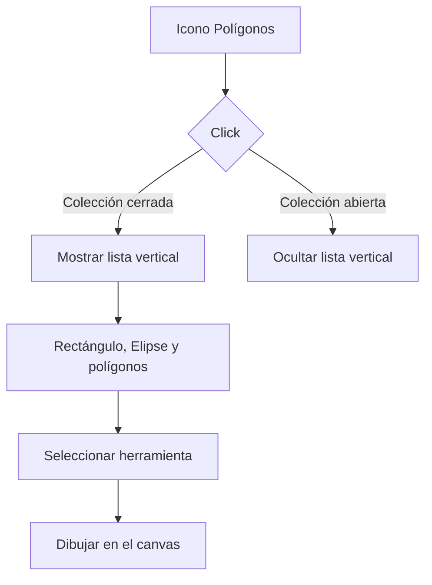

# Colección de polígonos básicos

```mermaid
flowchart TD
    A[Icono Polígonos] --> B{Click}
    B -->|Colección cerrada| C[Mostrar lista vertical]
    B -->|Colección abierta| D[Ocultar lista vertical]
    C --> E[Rectángulo, Elipse y polígonos]
    E --> F[Seleccionar herramienta]
    F --> G[Dibujar en el canvas]
```

La colección usa `
` nativo: el icono actúa como `summary`, la lista se despliega debajo y cada opción conserva la clase `.tool-btn` y su `data-tool` original.
