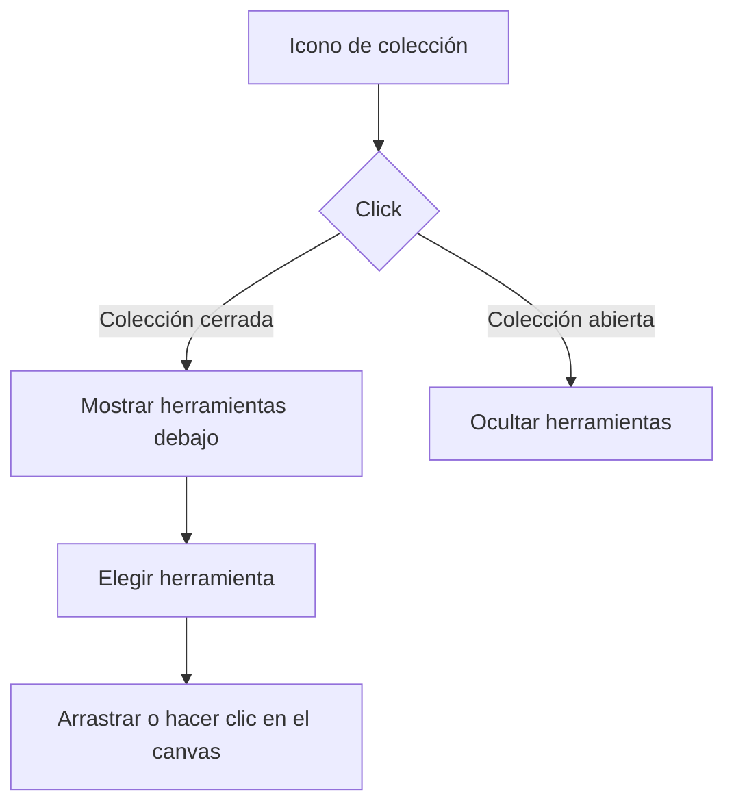

# Colecciones de herramientas

La barra lateral izquierda agrupa las herramientas con varias opciones en colecciones nativas `
`, en este orden:

- Polígonos básicos: rectángulo, rectángulo redondeado, elipse, triángulo, rombo, pentágono, hexágono y estrella.
- Diagramas de flujo: línea, flecha, conector ortogonal, inicio/fin, proceso, decisión, entrada/salida, documento y subproceso.
- UI software: texto, nota, frame y los componentes arrastrables Button, Input, Textarea, Checkbox, Toggle, Card, Avatar, Navbar, Sidebar, Table, Image y Modal.
- Bases de datos: símbolo de almacenamiento, Tabla, Vista, Clave primaria, Clave foránea, Índice, Consulta SQL y conector de Relación.

Cada colección empieza contraída. Las herramientas de dibujo mantienen la clase `.tool-btn` y su `data-tool`; los componentes UI mantienen `.component-item` y `data-component`. Todos los bloques UI y de bases de datos pueden seleccionarse con un clic y colocarse con otro clic en el lienzo, con su tamaño inicial. También pueden dibujarse arrastrando en el lienzo para ajustar su tamaño, o arrastrarse directamente desde la biblioteca. Ambas vías comparten la creación, selección, ajuste a cuadrícula y un único paso de historial; al colocar el bloque se vuelve al puntero. Escape o elegir otra herramienta cancela la colocación pendiente. La pestaña Componentes del panel derecho ofrece la misma interacción.

Los iconos de cada opción usan SVG propio. Los componentes UI también se renderizan en el canvas con detalles visuales específicos —controles, filas, cabeceras, rejillas, imágenes y ventanas— para que no se confundan entre sí.

Las cabeceras muestran una flecha que indica apertura y cierre, y resaltan la colección que contiene la herramienta activa. Desde 120 px de ancho aparecen los títulos y una superficie delimitada para las opciones abiertas; desde 200 px, las opciones pasan a tarjetas con icono y nombre en una cuadrícula adaptable. Pueden permanecer abiertas varias colecciones y se conserva el desplazamiento vertical sin comprimir sus contenidos. La animación de apertura respeta la preferencia de movimiento reducido.

Los seis bloques nuevos de bases de datos se arrastran al lienzo como grupos con cabecera y filas editables. Conservan nombres propios, puntos de conexión y el tipo al guardarse o exportarse. Tabla y Vista muestran campos; las claves incluyen PK/FK y una referencia de ejemplo; Índice y Consulta SQL muestran su estructura textual. Son elementos de diseño, no ejecutan consultas. Relación reutiliza el conector ortogonal con etiquetas editables.
