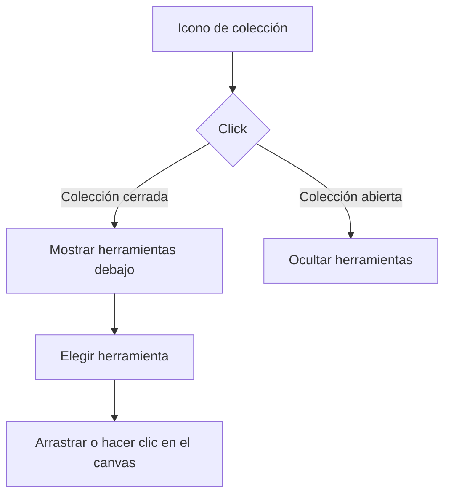

# Colecciones de herramientas

La barra lateral izquierda agrupa las herramientas con varias opciones en colecciones nativas `
`, en este orden:

- Polígonos básicos: rectángulo, rectángulo redondeado, elipse, triángulo, rombo, pentágono, hexágono y estrella.
- Diagramas de flujo: línea, flecha, conector ortogonal, inicio/fin, proceso, decisión, entrada/salida, documento y subproceso.
- UI software: texto, nota, frame y los componentes arrastrables Button, Input, Textarea, Checkbox, Toggle, Card, Avatar, Navbar, Sidebar, Table, Image y Modal.
- Bases de datos: base de datos.

Cada colección empieza contraída. Las herramientas de dibujo mantienen la clase `.tool-btn` y su `data-tool`; los componentes UI mantienen `.component-item` y `data-component`, por lo que la selección, los atajos y el arrastre al canvas conservan el comportamiento existente. La pestaña Componentes del panel derecho sigue ofreciendo la misma biblioteca completa.

Los iconos de cada opción usan SVG propio. Los componentes UI también se renderizan en el canvas con detalles visuales específicos —controles, filas, cabeceras, rejillas, imágenes y ventanas— para que no se confundan entre sí.
