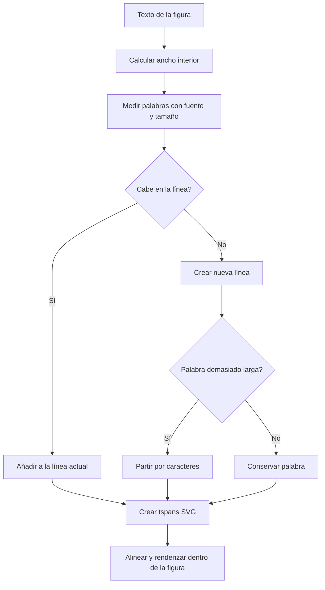

# Editor gráfico

## Propósito

Permite crear y editar elementos vectoriales básicos sobre un lienzo SVG para construir diseños y diagramas.

## Comportamiento principal

- El lienzo parte de 1920×1080, mantiene un modelo de documento con elementos ordenados por `zIndex` y ofrece herramientas para rectángulos, elipses, polígonos, líneas, flechas, texto, notas y frames.
- Al arrastrar una herramienta se crea el elemento; un clic breve usa tamaños predeterminados para las figuras, y texto o nota se insertan en el punto indicado.
- También se pueden arrastrar al lienzo archivos de imagen compatibles; se incrustan como imágenes y se limitan a una dimensión máxima de 600 píxeles.
- Cada elemento recibe un identificador propio y conserva geometría, rotación, visibilidad, bloqueo, estilo, texto y puntos de conexión cuando aplican.
- Un doble clic sobre un elemento editable abre un campo de texto temporal. Enter confirma el cambio y Escape lo cancela.
- El renderizador convierte el modelo en capas SVG separadas para cuadrícula, conectores, formas, texto, selección, guías y previsualizaciones.
- La malla tiene que tener poca opacidad que sea sutil, para que no destaque demasiado en los componentes dibujados en el mapa
- Si el modo puntero del ratón está seleccionado, pero el usuario intenta arrastrar en el canvas vacío, se le permitirá arrastrarse
- Los componentes, los polígonos, rectángulos, eclípses, etc tienen que tener un color de relleno por defecto que contraste bien dependiendo del modo oscuro o modo claro
- El texto de las figuras se ajusta a varias líneas cuando supera el ancho interior disponible, respetando alineación, saltos de línea y palabras largas.

## Flujo de ajuste de texto

## Criterios de aceptación

- Crear una figura desde la barra izquierda la añade al documento, la muestra en el lienzo y la deja seleccionada.
- Crear texto o nota en una posición concreta permite editar su valor y conserva el cambio al confirmar.
- Un elemento visible se representa con su geometría y contenido actuales, respetando el orden de capa.

## Evidencia de código

- `app/index.html`
- `app/js/model/shapes.js`
- `app/js/ui/ui.js`
- `app/js/editor/renderer.js`
