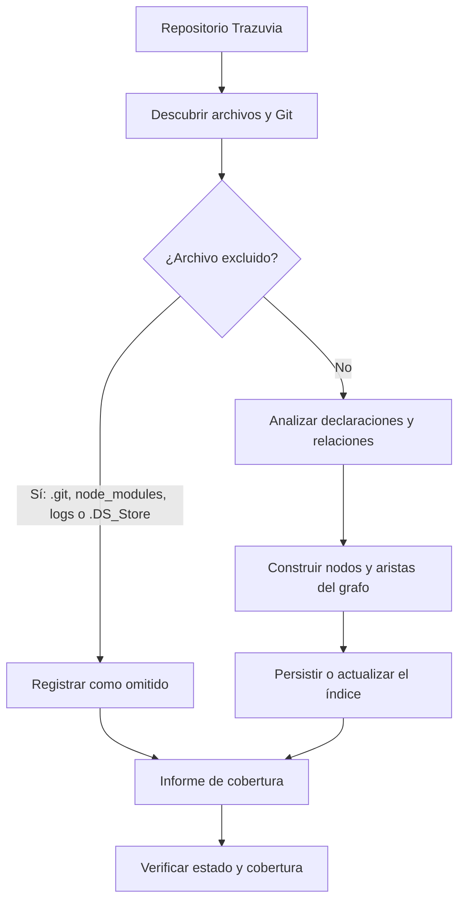

# Indexación con codebase-memory

## Flujo

## Comportamiento

- `codebase-memory` identifica el proyecto por su raíz Git y mantiene un nombre estable para consultarlo.
- El grafo representa símbolos y relaciones estructurales como `DEFINES`, `IMPORTS` y `CALLS`.
- Las exclusiones del repositorio no se consideran errores; se reportan como contenido omitido.
- Los archivos que el parser no puede analizar se reportan como cobertura parcial o no utilizable y deben revisarse por separado.

## Resultado de la ejecución actual

- El proyecto ya tenía un índice válido de `684` nodos y `2284` aristas.
- La reconstrucción solicitada quedó bloqueada por una incompatibilidad del daemon global: la sesión activa usa una identidad distinta a la versión `0.11.0` del worker.
- El índice existente no se eliminó ni se presentó como actualizado. El parser también reportó `SDD_specs/specs/demostracion.md` como no utilizable.
