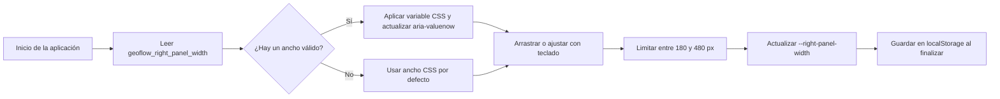

# Persistencia del ancho del panel derecho

El ancho del panel es una preferencia de interfaz local. No se incorpora al JSON del diseño, por lo que cambiar de proyecto no altera la preferencia guardada.
