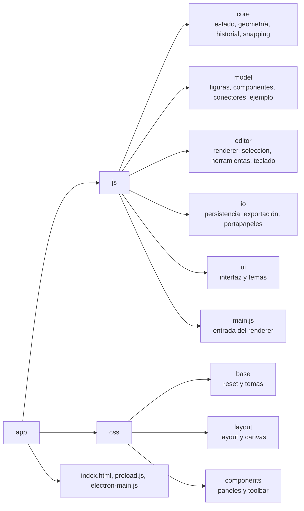

"# OpenDesign" 

## Organización del código

Los módulos se agrupan por responsabilidad para mantener localizables las piezas de cada flujo:

Los puntos de entrada (`main.js`, `index.html`, `preload.js` y `electron-main.js`) permanecen visibles fuera de las categorías para no ocultar el arranque de Electron.
